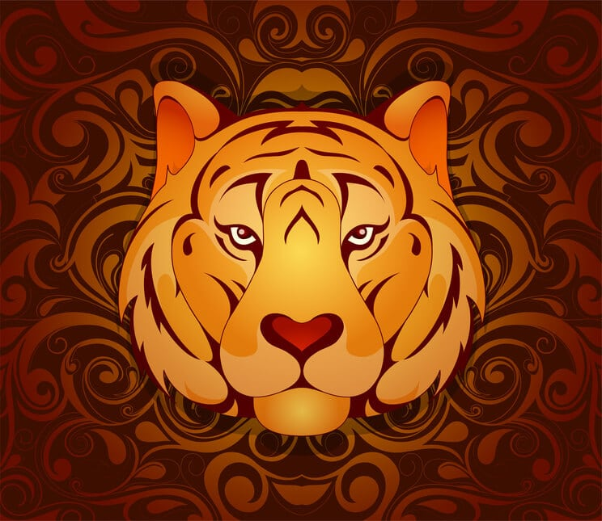

# Happy New Year!

This year is the Year of the Tiger!

Tigers are "...courageous and energetic, love a challenge or competition and are prepared to take risks. They are hungry for excitement and crave attention. They can also be rebellious, short-tempered and outspoken, prefering to give orders rather than take them, which often leads to conflict." (Victoria and Albert Muesem)

Are you born in the year of the tiger? The years are (in the past century, according to CNET):

- 1926
- 1938
- 1950
- 1962
- 1974
- 1986
- 1998
- 2010
- 2022 (this year!)

If yes, congratulations! Accoriding to the quote, you...

1. are "courageous and energetic"
2. "love a challange"
3. "are prepared to take risks"
4. "are hungry for excitement"
5. "crave attention"
6. "can ... be rebbelious"
7. "can ... be ... short-tempered"
8. "can ... be ... outspoken"
9. can prefer "to give orders rather than take them, which often leads to confict."

> Numbers 1-5 are the good, numbers 6-8 are the bad, and number 9 is the ugly.

> Past years:
> 
> - [2021](2021)
